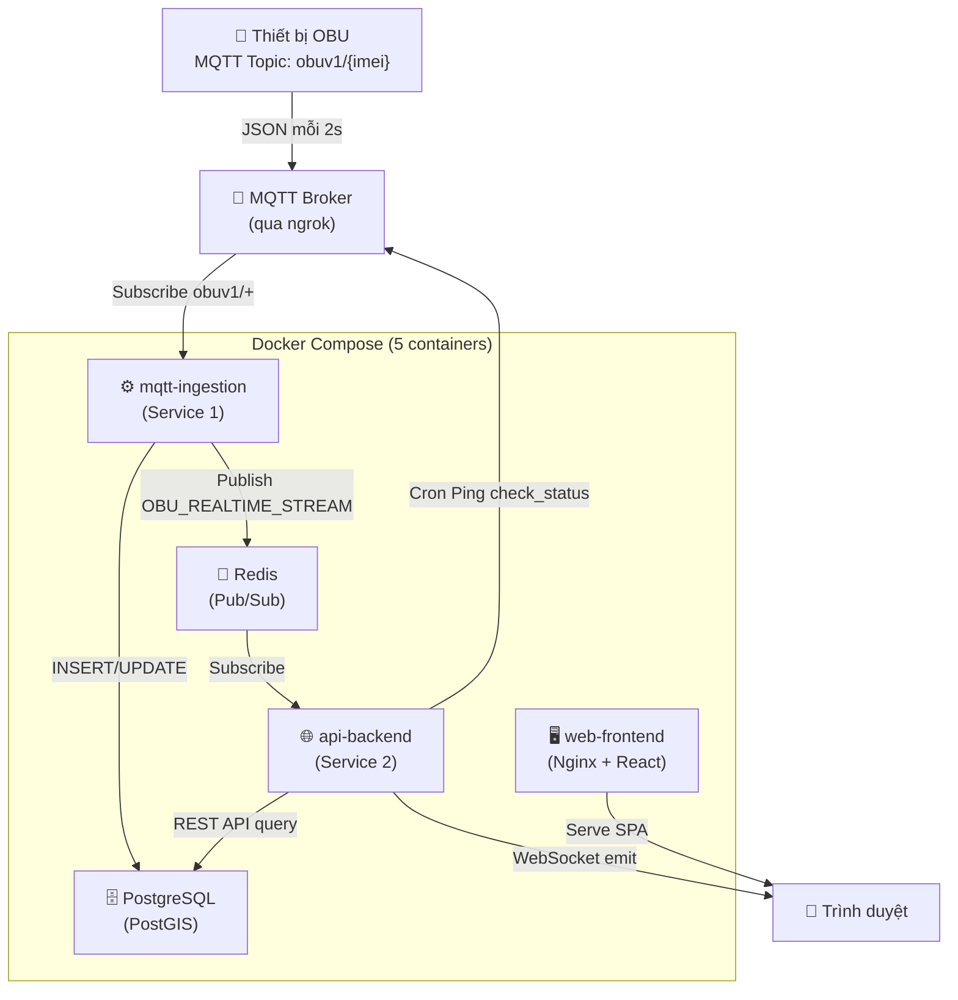
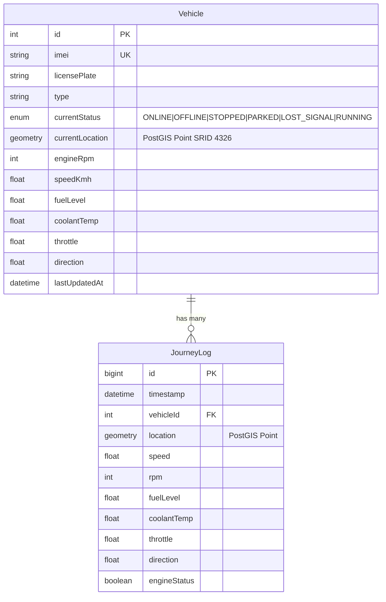

# 🔍 Tổng Quan Hệ Thống OBU Fleet Tracker — Báo Cáo Xem Lại Toàn Bộ

---

## 1. Tổng Quan Kiến Trúc

Hệ thống **OBU Fleet Tracker** là một nền tảng giám sát phương tiện thời gian thực, được xây dựng theo kiến trúc **Microservices Monorepo** sử dụng **Turborepo**.



---

## 2. Cấu Trúc Thư Mục (Monorepo)

| Thư mục | Vai trò | File chính |
|---|---|---|
| `apps/mqtt-ingestion/` | Service 1 — Hút dữ liệu IoT 24/7 | [index.js](file:///d:/Elcom/OBU/OBU_ELcom_Building/obu-system/apps/mqtt-ingestion/src/index.js), [parser.js](file:///d:/Elcom/OBU/OBU_ELcom_Building/obu-system/apps/mqtt-ingestion/src/parser.js) |
| `apps/api-backend/` | Service 2 — REST API + WebSocket + Cron | [server.js](file:///d:/Elcom/OBU/OBU_ELcom_Building/obu-system/apps/api-backend/src/server.js), [vehicles.js](file:///d:/Elcom/OBU/OBU_ELcom_Building/obu-system/apps/api-backend/src/routes/vehicles.js), [socketHub.js](file:///d:/Elcom/OBU/OBU_ELcom_Building/obu-system/apps/api-backend/src/socketHub.js), [pingStatus.js](file:///d:/Elcom/OBU/OBU_ELcom_Building/obu-system/apps/api-backend/src/cron/pingStatus.js) |
| `apps/web-frontend/` | Giao diện React (Vite + Leaflet Map) | [VehicleContext.jsx](file:///d:/Elcom/OBU/OBU_ELcom_Building/obu-system/apps/web-frontend/src/context/VehicleContext.jsx), 3 pages, UI components |
| `packages/database/` | Prisma ORM dùng chung cho cả 2 service | [schema.prisma](file:///d:/Elcom/OBU/OBU_ELcom_Building/obu-system/packages/database/prisma/schema.prisma) |

---

## 3. Luồng Dữ Liệu Chi Tiết

### 3.1 Luồng Real-time (Xe đang chạy)

```
OBU gửi JSON → MQTT Broker (obuv1/{imei})
    → mqtt-ingestion nhận message
        → parseObuMessage() giải mã JSON (hỗ trợ cả JSON malformed)
        → determineVehicleStatus(rpm, speed, car_response) → RUNNING | STOPPED | PARKED
        → Lọc GPS 0,0 (Null Island filter)
        → UPDATE bảng vehicles (snapshot mới nhất) — dùng $executeRawUnsafe + PostGIS
        → Buffer log vào journeyLogsBuffer[]
        → Publish JSON lên Redis channel "OBU_REALTIME_STREAM"

    → api-backend (socketHub.js) Subscribe Redis
        → Nếu có người đang xem web (clientsCount > 0): emit 'vehicle_moved' qua WebSocket
        → Nếu không ai xem: drop packet (tiết kiệm tài nguyên)
    
    → Mỗi 2 giây: Flush buffer → Batch INSERT vào journey_logs (retry 3 lần)
```

### 3.2 Luồng Offline Detection (Cron Watchdog)

```
Mỗi 3 phút (node-cron):
    1. Tìm xe có lastUpdatedAt > 10 phút → Mark OFFLINE + Push Redis notification
    2. Tìm xe có lastUpdatedAt 3–10 phút → MQTT Publish "check_status" vào obuv1/{imei}
        → Nếu OBU còn sống: phản hồi JSON → Luồng Real-time xử lý bình thường
        → Nếu im lặng → Lần cron tiếp theo sẽ mark OFFLINE
```

### 3.3 Luồng Lịch Sử Hành Trình (Journey History)

```
Frontend chọn Xe + Ngày → GET /api/vehicles/{imei}/history?start=...&end=...
    → Backend query journey_logs (PostGIS) ORDER BY timestamp ASC
    → Tính tổng quãng đường: ST_Length(ST_MakeLine(location)::geography) / 1000
    → Lọc GPS 0,0 ngay trong SQL (CASE WHEN)
    → Frontend nhận data → journeyFormatter.js format → Vẽ Polyline trên Leaflet Map
```

---

## 4. Database Schema (PostgreSQL + PostGIS)

Hai bảng cốt lõi trong [schema.prisma](file:///d:/Elcom/OBU/OBU_ELcom_Building/obu-system/packages/database/prisma/schema.prisma):



- **Vehicle**: Snapshot trạng thái mới nhất của xe — được UPDATE liên tục bởi `mqtt-ingestion`.
- **JourneyLog**: Time-series log với tốc độ ghi **~1 bản ghi/2 giây/xe**. Có composite index `(vehicleId, timestamp)`.

---

## 5. REST API Endpoints

| Method | Endpoint | Mô tả |
|---|---|---|
| `GET` | `/api/vehicles` | Danh sách tất cả xe + trạng thái + tọa độ |
| `GET` | `/api/vehicles/:imei/history?start=&end=` | Lịch sử hành trình (Polyline data) + totalKm |
| `GET` | `/api/vehicles/:imei/check` | Kiểm tra IMEI có active trong 5 phút không |
| `POST` | `/api/vehicles` | Đăng ký xe mới (upsert IMEI + biển số) |
| `PUT` | `/api/vehicles/:imei` | Cập nhật biển số / loại xe |
| `DELETE` | `/api/vehicles/:imei` | Xóa xe + cascade xóa journey_logs |

**WebSocket Event:** `vehicle_moved` — emit real-time data `{imei, lat, lng, speed, rpm, fuel, direction, status}`

---

## 6. Logic Phân Loại Trạng Thái Xe

Hàm [determineVehicleStatus()](file:///d:/Elcom/OBU/OBU_ELcom_Building/obu-system/apps/mqtt-ingestion/src/parser.js#L20-L41) trong `parser.js`:

| Điều kiện | Trạng thái | Ý nghĩa |
|---|---|---|
| `speed >= 1 km/h` | `RUNNING` | Xe đang di chuyển |
| `speed < 1` + `car_response = "0"` | `PARKED` | Tắt máy, đỗ xe |
| `speed < 1` + `rpm > 0` | `STOPPED` | Nổ máy nhưng đứng yên (chờ đèn đỏ) |
| `speed < 1` + `rpm = 0` | `PARKED` | Đỗ xe |
| `lastUpdatedAt > 10 phút` (Cron) | `OFFLINE` | Mất tín hiệu |

---

## 7. Deployment Architecture (Docker Compose)

Xem [docker-compose.yml](file:///d:/Elcom/OBU/OBU_ELcom_Building/obu-system/docker-compose.yml):

| Container | Image | Port | Ghi chú |
|---|---|---|---|
| `obu-postgres` | `postgis/postgis:15-3.4` | Internal | Volume `pgdata` persistent |
| `obu-redis` | `redis:7-alpine` | Internal | Không expose ra host |
| `obu-api` | Custom Dockerfile | 5000 (internal) | Depends on postgres + redis |
| `obu-ingestion` | Custom Dockerfile | — | Background worker |
| `obu-frontend` | Nginx + React build | **3001 → 80** | Nginx reverse proxy đến API |

Biến môi trường qua `.env` file, `VITE_API_URL` và `VITE_SOCKET_URL` được inject lúc build.

---

## 8. Tài Liệu Docs — Tóm Tắt Nội Dung

| File | Nội dung chính |
|---|---|
| [system_architecture.md](file:///d:/Elcom/OBU/OBU_ELcom_Building/obu-system/docs/system_architecture.md) | Giải thích tại sao tách 2 service, kiến trúc DB 2 bảng |
| [system_analysis.md](file:///d:/Elcom/OBU/OBU_ELcom_Building/obu-system/docs/system_analysis.md) | **Báo cáo 16 vấn đề** phân theo mức độ nghiêm trọng (bảo mật → UX) |
| [project_structure_and_scaling.md](file:///d:/Elcom/OBU/OBU_ELcom_Building/obu-system/docs/project_structure_and_scaling.md) | Chiến lược Partitioning (TimescaleDB), Tech Stack, Deployment Strategy |
| [implementation_roadmap.md](file:///d:/Elcom/OBU/OBU_ELcom_Building/obu-system/docs/implementation_roadmap.md) | Kế hoạch triển khai 4 giai đoạn (Setup → Ingestion → API → Frontend) |
| [iot_status_flow_plan.md](file:///d:/Elcom/OBU/OBU_ELcom_Building/obu-system/docs/iot_status_flow_plan.md) | Cơ chế `car_response`, luồng Ping/Check Status, CronJob |
| [journey_history_implementation_plan.md](file:///d:/Elcom/OBU/OBU_ELcom_Building/obu-system/docs/journey_history_implementation_plan.md) | V2 Raw Data Plotting, lọc GPS 0,0, PostGIS `ST_Length` |
| [implementation_plan.md](file:///d:/Elcom/OBU/OBU_ELcom_Building/obu-system/docs/implementation_plan.md) | Kế hoạch tích hợp TimescaleDB (chưa thực hiện) |
| [monorepo_deployment.md](file:///d:/Elcom/OBU/OBU_ELcom_Building/obu-system/docs/monorepo_deployment.md) | 3 cách deploy Monorepo (Turborepo, Docker, Cloud) |
| [walkthrough.md](file:///d:/Elcom/OBU/OBU_ELcom_Building/obu-system/docs/walkthrough.md) | Hướng dẫn deploy từng bước (Windows → Ubuntu Server) |

---

## 9. Đánh Giá Hiện Trạng — Những Điểm Đã Làm Tốt ✅

1. **Kiến trúc Microservices rõ ràng** — Tách biệt hoàn toàn Ingestion và API, chết 1 không ảnh hưởng cái kia.
2. **Batch INSERT với Retry** — Buffer 2 giây + retry 3 lần, giảm connection pool exhaustion.
3. **Vehicle Cache có TTL 30 phút** — Đã fix issue stale cache vĩnh viễn.
4. **GPS 0,0 filter** ở cả Ingestion lẫn API query (CASE WHEN trong SQL).
5. **PostGIS `ST_Length`** tính tổng km chính xác ở backend, không đẩy cho frontend.
6. **`VehicleContext.jsx` dùng env vars** — `VITE_API_URL`, `VITE_SOCKET_URL` thay vì hardcode.
7. **WebSocket reconnect** — Có `reconnectionAttempts: 10` + lifecycle events (connect/disconnect/error).
8. **CronJob Watchdog** — Tự động ping xe ngủ + đánh dấu OFFLINE sau 10 phút.
9. **Docker Compose** đầy đủ 5 services với healthcheck cho Postgres.

---

## 10. Vấn Đề Còn Tồn Tại ⚠️

### 🔴 Nghiêm Trọng

| # | Vấn đề | File liên quan |
|---|---|---|
| 1 | **SQL Injection** — `$executeRawUnsafe()` chèn biến trực tiếp vào SQL string | [index.js:104-116](file:///d:/Elcom/OBU/OBU_ELcom_Building/obu-system/apps/mqtt-ingestion/src/index.js#L104-L116) |
| 2 | **API không có Authentication** — Bất kỳ ai cũng có thể xem/xóa xe | [vehicles.js](file:///d:/Elcom/OBU/OBU_ELcom_Building/obu-system/apps/api-backend/src/routes/vehicles.js) |
| 3 | **Socket.IO CORS `origin: "*"`** — Bất kỳ domain nào cũng connect được | [socketHub.js:8](file:///d:/Elcom/OBU/OBU_ELcom_Building/obu-system/apps/api-backend/src/socketHub.js#L8) |

### 🟠 Cao

| # | Vấn đề | Chi tiết |
|---|---|---|
| 4 | **Cron mở MQTT connection riêng** — Thừa tài nguyên, nên gửi qua Redis | [pingStatus.js:15](file:///d:/Elcom/OBU/OBU_ELcom_Building/obu-system/apps/api-backend/src/cron/pingStatus.js#L15) |
| 5 | **Logic trạng thái bị trùng lặp** — `parser.js` (1km/h) vs `journeyFormatter.js` (3km/h) | 2 file dùng ngưỡng khác nhau |
| 6 | **Batch INSERT vẫn dùng `$executeRawUnsafe`** — Tương tự vấn đề SQL Injection | [index.js:190](file:///d:/Elcom/OBU/OBU_ELcom_Building/obu-system/apps/mqtt-ingestion/src/index.js#L190) |

### 🟡 Trung Bình

| # | Vấn đề | Chi tiết |
|---|---|---|
| 7 | **History API không có LIMIT** — 24h = ~43,200 records trả về 1 lần | [vehicles.js:64-80](file:///d:/Elcom/OBU/OBU_ELcom_Building/obu-system/apps/api-backend/src/routes/vehicles.js#L64-L80) |
| 8 | **TimescaleDB chưa tích hợp** — Docs đề cập nhưng đang dùng postgis/postgis image | [docker-compose.yml:6](file:///d:/Elcom/OBU/OBU_ELcom_Building/obu-system/docker-compose.yml#L6) |
| 9 | **Dead code** — `journeyAggregator.js` vẫn tồn tại dù không được import | `web-frontend/src/utils/` |
| 10 | **Không có Unit Test** — Toàn bộ codebase 0 file test |

---

## 11. Tổng Kết

Hệ thống OBU Fleet Tracker đã được xây dựng với nền tảng kiến trúc tốt (2-service microservices, PostGIS, Redis Pub/Sub, Docker). Các cơ chế cốt lõi (GPS tracking, real-time WebSocket, offline detection, journey history) đều **hoạt động đầy đủ**. Các cải tiến từ `system_analysis.md` (cache TTL, batch retry, env vars, WebSocket reconnect) **đã được triển khai một phần**.

Vấn đề cần ưu tiên xử lý tiếp:
1. **Bảo mật** — Chuyển `$executeRawUnsafe` sang parameterized query, thêm Authentication cho API
2. **Thống nhất logic** — Đưa ngưỡng speed threshold về 1 file duy nhất
3. **Performance** — Thêm LIMIT cho history API, tích hợp TimescaleDB
4. **Dọn dẹp** — Xóa `journeyAggregator.js`, thêm Unit Tests
